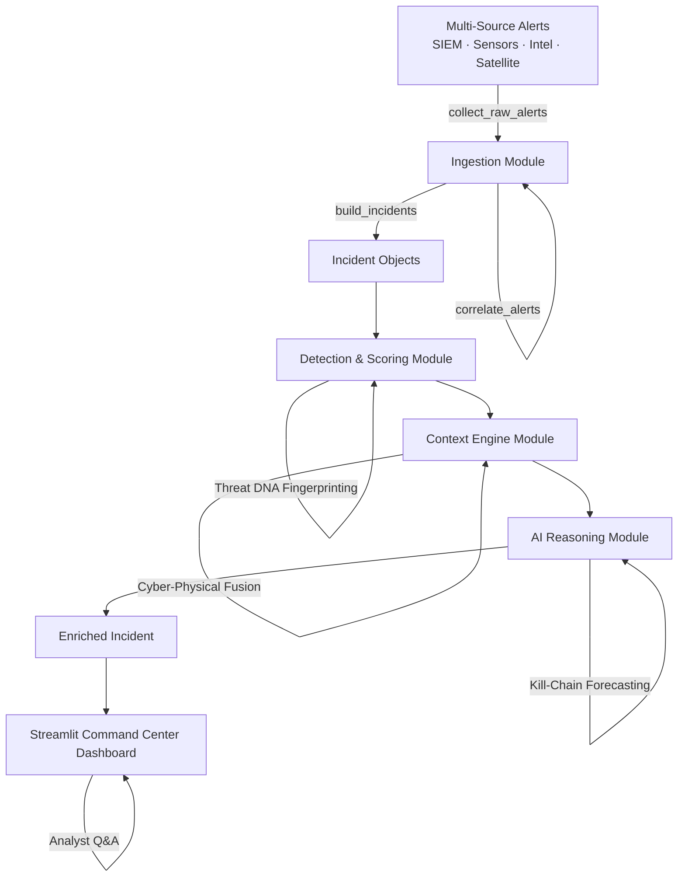

# Architecture

## System Architecture

The system is a modular Python pipeline with four independent processing stages
(Ingestion, Detection, Context Enrichment, AI Reasoning) orchestrated through a
shared `Incident` data contract, surfaced through an interactive Streamlit
dashboard. Each stage reads and enriches the same `Incident` object, so data
flows through the pipeline without any stage needing to know the internals of
another.

## Components

| Component | Technology | Responsibility |
|---|---|---|
| Ingestion Module | Python | Collects raw alerts from simulated SIEM, cyber sensor, intel report, and satellite feed sources; normalizes each source's differing field structure into one common `NormalizedAlert` format; correlates related alerts using IP/asset/time-window/event-type scoring; clusters correlated alerts into `Incident` objects. |
| Detection & Scoring Module | Python | Assesses each incident for false-positive likelihood; computes a 0–100 dynamic risk score from severity, source diversity, and behaviour; assigns a Critical/High/Medium/Low priority bucket; generates a unique behavioural "Threat DNA" fingerprint for cross-incident pattern matching. |
| Context Engine Module | Python | Maps observed alert behaviour to MITRE ATT&CK technique IDs; builds a chronological attack timeline; enriches IPs/indicators with reputation and known-bad status from data already present in the alerts; correlates cyber activity against an asset with simulated satellite/geospatial signals (Cyber-Physical Threat Fusion). |
| AI Reasoning Module | Python | Answers free-text analyst questions grounded in incident evidence; generates a structured BLUF (Bottom Line Up Front) report — threat, impact, confidence, evidence, next steps; produces investigation recommendations; predicts the attacker's likely next MITRE technique based on observed kill-chain progression. |
| Dashboard | Streamlit | Presents a Commander Overview (aggregate risk/priority metrics), a filterable/searchable incident list, and a per-incident investigation view combining Detection, Context, and Reasoning panels, including a live Analyst Q&A interface. |
| Shared Data Contract | Python `dataclasses` | A single `Incident` schema (`shared/schemas.py`) that every module reads from and writes additive fields to, enabling all four modules to be developed and tested independently without file conflicts. |

## Data Flow

1. Raw alerts are collected from four simulated source types (SIEM, cyber sensor, intelligence report, satellite feed), each using its own native field-naming convention.
2. The Normalization stage converts every source's raw format into a single common `NormalizedAlert` structure (unified timestamp, source, IP, asset, severity, event type).
3. The Correlation stage groups alerts that are likely part of the same attack, using a time-windowed scoring function based on shared IP, shared asset, and suspicious event-type co-occurrence (union-find grouping).
4. Correlated alert groups are clustered into `Incident` objects, each holding its full set of related alerts.
5. Each `Incident` passes through Detection & Scoring, which determines false-positive likelihood, computes a risk score, assigns a priority, and generates a Threat DNA signature.
6. The Context Engine enriches the same `Incident` with MITRE ATT&CK technique mappings, a chronological attack timeline, threat intelligence indicators, and (where applicable) a cyber-physical correlation against satellite/geospatial signals.
7. The AI Reasoning module consumes all prior fields to generate a human-readable AI explanation, a structured BLUF report, recommended investigation actions, and a prediction of the attacker's likely next technique.
8. The fully enriched `Incident` objects are passed to the Streamlit dashboard, which renders the Commander Overview, the filterable incident list, and the detailed per-incident investigation view — including a live Q&A box that calls the AI Investigation Assistant directly against the incident's evidence.

## Security Considerations

- No real external API calls or credentials are used anywhere in the pipeline — all threat intelligence and satellite/geospatial data are simulated locally, so there are no API keys or secrets to manage in this prototype.
- Threat intelligence reputation and known-bad flags are derived strictly from data already present in the alert payload; the system never invents or infers indicator reputation, reducing the risk of false attribution.
- Recommended actions generated by the AI Reasoning module are explicitly informational — the system never automatically executes any response action, keeping a human analyst in the loop for all remediation decisions.
- All pipeline modules are designed defensively: malformed or missing alert fields are handled gracefully (skipped or defaulted) rather than crashing the pipeline, reducing the risk of a single bad input disrupting incident processing.

## Scalability Notes

The current prototype processes a fixed, in-memory batch of simulated alerts on each run. To scale beyond the hackathon prototype:

- The Ingestion module's `collect_raw_alerts` function could be extended to poll real SIEM/EDR APIs and message queues (e.g., Kafka) instead of returning simulated data, without requiring any change to the downstream Detection, Context, or Reasoning modules, since they only depend on the shared `Incident` schema.
- The four pipeline stages (Ingestion, Detection, Context, Reasoning) are already cleanly decoupled through the shared data contract, so each could be deployed as an independent service and scaled horizontally behind a message queue for high alert volumes.
- The correlation stage currently uses an O(n²) pairwise comparison suitable for prototype-scale data; at production alert volumes this would need to move to an indexed or streaming correlation approach (e.g., time-bucketed indexing on IP/asset).
- Threat DNA signature matching against historical incidents would benefit from a persistent vector or similarity-search store rather than in-memory comparison, to support fast lookups across a growing incident history.
